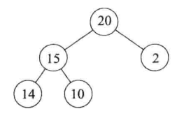
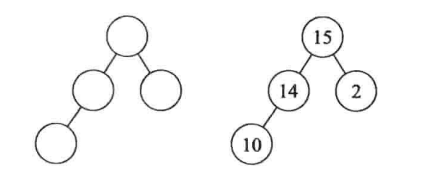

[TOC]
## 1.优先级队列中的概念
优先级队列（priority_queue）是 C++ 标准模板库（STL）中的一个**容器适配器**，优先级队列的底层实现是**堆**，堆是一棵**完全二叉树**。优先级队列的弹出顺序并不是按照插入的顺序进行的，堆会按照大顶堆或小顶堆（默认为大顶堆）需求对插入的元素按照**优先级**进行排序，最终弹出顺序是按照堆内的排序顺序。
优先级队列有两种类型：最大优先级队列和最小优先级队列。最大优先级队列的根节点为最大值，父节点的值大于等于子节点的值；最小优先级队列的根节点为最小值，父节点值小于等于子节点值。
>完全二叉树：除了最后一层叶子节点外有缺省外，其他层均没有缺省节点，并且最后一层叶子节点从左到右是连续分布，不存在节点间的间隔跳跃。

## 2.优先级队列的特征
优先级队列的常用操作包括**插入元素**、**删除元素**、**查看队首元素的值**等，对应的操作函数是**push()**、**pop()**、**top()**，其他操作包括判断是否为空（函数：empty()），获取队列的大小（函数：size()）等。

C++中优先级队列位于queue头文件中，在使用时必须在头文件中include \<queue\>头文件。

定义一个优先级队列，需要指定的参数类型包括**底层数据的数据类型**，**底层数据的存储方式**，**优先级队列的排序方式**。以下方代码为例，其中存储的数据类型为一对键值对pair<int,int>，键值对的存储数据结构为vector数组，排序方式由mycomparison类定义。
在mycomparison类的定义中，以键值对的值作为比较优先级，$lhs.second > rhs.second$表示会生成小顶堆，$lhs.second \le rhs.second$生成大顶堆。

```C++
#include <iostream>
#include <queue>
#include <vector>
#include <unordered_map>

using namespace std;

class mycomparison {
    public:
        // 重载operator()函数以自定义比较类
        bool operator()(const pair<int, int>& lhs, const pair<int, int>& rhs) {
            // 左大于右即生成了小顶堆，反之是大顶堆（默认也是大顶堆）
            return lhs.second > rhs.second;
        }
    };

priority_queue<pair<int, int>, vector<pair<int, int>>, mycomparison> pri_que;
```

### 1. 优先级队列（堆）的插入
优先级队列插入元素的过程与完全二叉树插入元素的过程是一致的。以大顶堆为例，新元素有可能直接续为最新的叶子节点，时间复杂度为$O(1)$；新元素有可能成为新的根节点，时间复杂度为$O(logn)$；新元素有可能成为新的中间层节点，时间复杂度在$O(1)$和$O(logn)$之间。

```C++
for(unordered_map<int, int>::iterator it = map.begin(); it != map.end(); ++it){
    pri_que.push(*it);        // it是一个迭代器，*it是一个键值对
    if (pri_que.size() > k) { // 如果堆的大小大于了K，则队列弹出，保证堆的大小一直为k
        pri_que.pop();
    }
}
```

>1.$logn$为完全二叉树的高度。
>2.此处定义了一个unordered_map<int, int>类型的迭代器，迭代器是专门为C++标准库中的容器设计的，提供类似于指针的操作（如iter++、iter--、*iter），但是迭代器隐藏了底层数据结构的细节，且迭代器并不直接针对内存地址进行操作。

### 2. 优先级队列（堆）的删除
优先级队列插入元素的过程与完全二叉树插入元素的过程是一致的。以大顶堆为例，执行删除操作即为删除根节点。在删除根节点后，需要对完全二叉树进行重新组织以维持一个新的大顶堆。
以图示左侧大顶堆为例，删除大顶堆中根节点20，删除后结构如中间图所示。先取出最底层节点10，并将原节点删除。如果将10放入根节点，不满足大顶堆要求，取根节点两个子节点的最大值15，将其作为新的根节点。将10放在原15所在节点，仍不对（10<14），重新取子节点的最大值14，以14作为父节点，10作为子节点，结果成立，新的大顶堆如图示右侧所示。

<div style="display: flex; justify-content: space-between;">
  
  
</div>

每层执行的时间复杂度为$O(1)$，从上到下重构二叉树的时间复杂度为$O(height) = O(logn)$。

### 3. 优先级队列（堆）排序
从上述描述可以注意到，堆（优先级队列）可以用来排序。将n个元素插入一个优先级队列中初始化一个堆，使用**Heapify Method**初始化堆的时间复杂对为$O(n)$。逐个删除大顶堆根节点，每次时间复杂度为$O(logn)$，因此总的时间复杂度为$O(n + nlogn)$，总体为$O(nlogn)$。
>day_stack_queue实际已经实现了使用小顶堆的排序