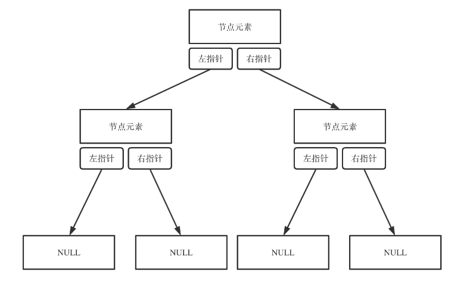

[TOC]

## 1.什么是二叉树？
### 1.二叉树的定义

**二叉树（Binary Tree）** 是一种常见的树形数据结构，节点是二叉树的基本构成单元，其中每个节点最多有两个子节点，分别称为左子节点和右子节点，每个节点被称为其子节点的父节点。

### 2.二叉树的属性
#### 1.二叉树中的重要属性
**根节点**：二叉树的顶层节点，没有父节点。
**叶节点**：没有子节点的节点，通常位于树的最底层。
**内部节点**：除根节点与叶节点之外的其他节点称为内部节点。
**度**：在二叉树中，一个节点的度是指该节点拥有的子节点的数量。由于二叉树中每个节点最多有两个子节点，因此节点的度最多为2。
**高度**：从根节点到最远叶子节点的最长路径上的节点数。
**深度**：从根节点到某个节点的路径上的节点数。

#### 2.二叉树的类型
**满二叉树**：

**完全二叉树**：除了最后一层外，每一层的节点都被完全填充，并且所有节点都尽可能地靠左，叶子节点之间不存在连续跳跃。

**平衡二叉树**：

**二叉搜索树**：

**完美二叉树**：

## 2.二叉树有哪些操作？
### 1.构造二叉树
二叉树有顺序存储和链式存储两种形式，顺序存储的方式就是用数组，链式存储方式就用指针。

#### 1.用数组构造二叉树
顾名思义，顺序存储的元素在内存是连续分布的，数组是实现顺序存储的最佳选择。

#### 2.用链表构造二叉树
顾名思义，链式存储就是通过指针把分布在各个地址的节点串联一起，其结构图如图所示。

>上图来自[代码随想录](https://programmercarl.com/%E4%BA%8C%E5%8F%89%E6%A0%91%E7%90%86%E8%AE%BA%E5%9F%BA%E7%A1%80.html#%E4%BA%8C%E5%8F%89%E6%A0%91%E7%9A%84%E5%AD%98%E5%82%A8%E6%96%B9%E5%BC%8F)

### 2.遍历二叉树
#### 1.深度优先遍历

##### 1.前序遍历
前序遍历的过程是：中左右，即先输出中间节点，再输出左子树节点，最后输出右子树节点，对左子树和右子树也是使用中左右的顺序。

二叉树的前序遍历有三种写法，分别是递归法、非统一模板栈模拟递归法、统一模板栈模拟递归法。
+ 对于递归法，详细理解可以参考该[链接](https://www.bilibili.com/video/BV1Ky41187qT/?spm_id_from=333.337.search-card.all.click&vd_source=6e3b9dd8c091f937c5139a3c3edb569d)内的动画过程，具体代码参考[day42_tree1.cpp](day42_tree1.cpp)中的Solution_1;
+ 对于非统一模板栈模拟递归法，前序遍历的实现思路是先将根节点放入栈中，然后开始循环判断，当栈不为空时，先将栈顶的中间节点出栈，再将他的右子节点入栈，然后将左子节点入栈，如此以来输出的顺序就是中左右。具体代码参考[day42_tree1.cpp](day42_tree1.cpp)中的Solution_2，流程参考以下演示图像；

+ 对于统一模板栈模拟递归法，前序遍历的访问顺序和处理顺序都是从上往下，实现思路是先将根节点入栈，随后开始循环判断，当栈不为空时，先将栈顶的中间节点出栈，随后将该节点的右节点和左节点入栈，接着将中间节点重新入栈，在其后再加一个空指针作为标记，表示中间节点要先处理。具体代码参考[day42_tree1.cpp](day42_tree1.cpp)中的Solution_3。

##### 2.中序遍历
中序遍历的过程是：左中右，即先输出左子树节点，再输出中间节点，最后输出右子树节点，对左子树和右子树也是使用中左右的顺序。
+ 对于递归法，其过程与前序遍历相似，只是在访问中间节点和访问左右子树的顺序上存在差别，具体代码参考[day42_tree3.cpp](day42_tree3.cpp)文件中的Solution_1;
+ 对于非统一模板栈模拟递归法，中序遍历的访问是从上到下，但处理是从下到上，需要借助指针进行二次访问。实现思路是先一路往下找到二叉树最左侧叶子节点并将前面的节点全部入栈，然后处理该节点，并将其右子节点入栈，右子节点为空不入栈，再次获取栈顶即为该叶子节点的父节点，处理该节点并将其右子节点入栈，如此循环往复，循环判断条件是栈不为空。具体代码参考[day42_tree3.cpp](day42_tree3.cpp)文件中的Solution_2;

+ 对于统一模板栈模拟递归法，中序遍历的实现思路是先将根节点入栈，随后开始循环判断，当栈不为空时，先将中间节点出栈，然后将其右子节点入栈，接着将中间节点重新入栈并再加入一个空指针作为待处理标记，随后将左子节点入栈。具体代码参考[day42_tree3.cpp](day42_tree3.cpp)文件中的Solution_3。

##### 3.后序遍历
后序遍历的过程是：左右中，即先输出左子树节点，再输出右子树节点，最后输出中间节点，对左子树和右子树也是使用左右中的顺序。
+ 对于递归法，其过程与前序遍历相似，只是在访问中间节点和访问左右子树的顺序上存在差别，具体代码参考[day42_tree2.cpp](day42_tree2.cpp)文件中的Solution_3;

+ 对于非统一模板栈模拟递归法，前序遍历的非统一模板栈模拟递归的入栈顺序是右左中，将入栈顺序改为左右中，处理完后将结果翻转即可，具体代码参考[day42_tree2.cpp](day42_tree2.cpp)文件中的Solution_2;

+ 对于统一模板栈模拟递归法，后序遍历的实现思路是先将根节点入栈，随后开始循环判断，当栈不为空时，先将中间节点出栈，然后将中间节点重新入栈并再加入一个空指针作为待处理标记，接着将其右子节点入栈，随后将左子节点入栈。具体代码参考[day42_tree3.cpp](day42_tree3.cpp)文件中的Solution_3。

#### 2.广度优先遍历
##### 层序遍历
层序遍历有两种实现方式，一种是使用队列，一种是递归式。
+ 使用队列实现，最关键的是判断到底当前层有多少个节点需要遍历，

## 3.二叉树怎么用？
